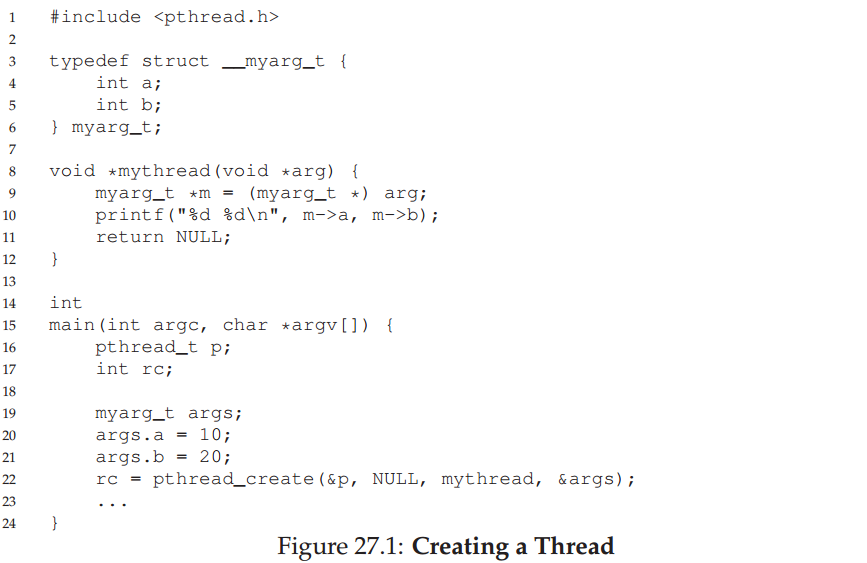
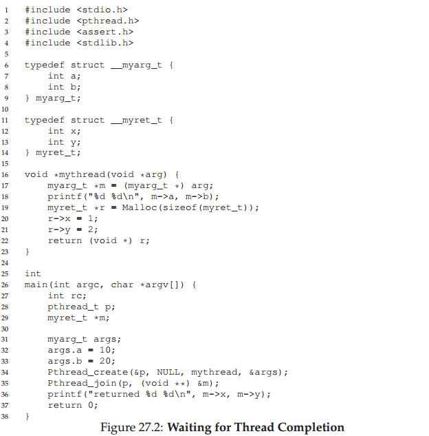
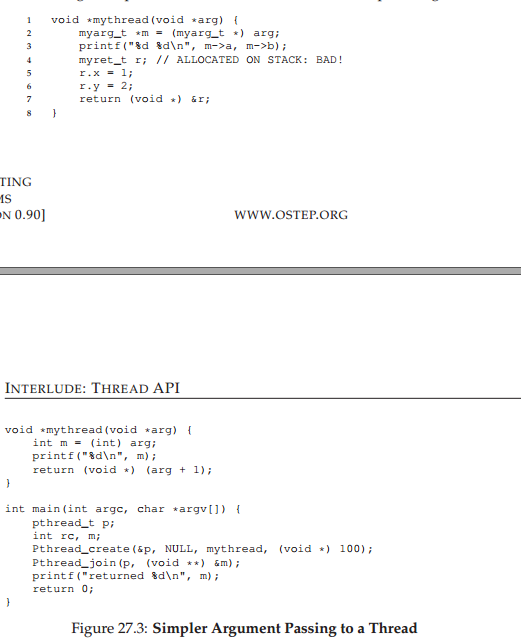

# 27 插曲：线程API
本章简要介绍线程API的主要部分。每个部分将在随后的章节中进一步解释，为我们展示了如何使用API。更多细节可以在各种书籍和网上找到源[B89，B97，B +96，X +96]。我们应该注意到，后面的章节有很多例子介绍了锁和条件变量的概念比较慢；从而更好本章用作参考

> 关键：如何创建和控制线程
> 
> 操作系统应该为线程的创建和控制提供什么接口？应该如何设计这些接口来保证易用性以及效用？


## 27.1 线程创建
创建多线程程序第一步要完成的事当然是创建新的线程，所以必须有一些线程创建的接口，在POSIX中，它很简单：

```
#include <pthread.h>
int
pthread_create( pthread_t * thread,
       const pthread_attr_t * attr,
    void * (*start_routine)(void*),
                        void * arg);
```

这个定义虽然看起来有点复杂，但是其实并不是那么糟糕。它有4个参数分别是thread, attr, start_routine和arg。

第一个参数，```thread```，是指向类型为pthread_t结构体的指针；我们要使用这个结构体与这个线程交互，所以我们需要传入它用pthread_create初始化它。

第二个参数，```attr```，被用来表明该线程可能拥有的属性。比如说设置堆栈的大小或者表明该线程的调度优先级。属性被独立的```pthread_attr_init()```调用初始化；可以在手册中查看更详细的信息。然而，在大多数情况下，用默认值就够了，也就是传入一个```NULL```。

第三个参数是最复杂的，但是这正是问题所在：该线程创建后会运行什么函数呢？在C语言中，我们把它叫做函数指针，这个参数告诉我们它需要的是：一个函数名为start_route，拥有一个```void*```参数（正如start_route后面括号内的内容），同时返回一个```void*```型的值（比如void指针）。

如果该函数需要一个整形参数而不是```void```型指针，声明会像这个一样：
```
int pthread_create(..., // 前两个参数一样
                    void * (*start_routine)(int),
                    int arg);
```
如果需要一个```void```型指针的参数，但是返回一个整数，声明会像这个一样：
```
int pthread_create(..., // 前两个参数一样
                    void * (*start_routine)(int),
                    int arg);
```
最终，第四个参数```arg```正是会被传入该线程刚开始要执行的函数的参数。你也许会问：我们为什么需要这个```void```型指针？恩，答案非常简单：使用```void```型指针作为传入函数```start_routine```的一个参数允许我们传入任何类型的函数；同理可以允许该线程返回任何类型的结果。

让我们看一下图27.1的例子。在这里，我们只是创建一个线程并传递两个参数，打包成一个单一类型的，我们自己定义（```myarg _t```）。线程，一旦创建，可以简单地解包转型成需要的参数。

就是这样！一旦你创建一个线程，你就真的拥有另一个运行上下文，使用自己的运行堆栈，与程序内所有存在的线程共享相同地址空间。好玩的事情要开始了！


## 27.2 线程完成

上面的例子告诉我们如何创建一个线程。然而，如果我们想等待一个线程执行完毕如何做呢？你需要做一些特别的事情来等待它的完成，也就是你需要调用函数```pthread_join()```。
```
int pthread_join(pthread_t thread, void **valut_ptr);
```


这个函数有两个参数。第一个pthread_t类型的参数，被用于指定等待哪个线程。 该变量由创建函数初始化（传入```pthread_t```的指针给```pthread_create()```）。如果你持有着它，你可以用它来等待线程的终止。

第二个参数是指向你希望得到的返回值。因为函数可以返回任何值，所以它被定义为返回一个```void```型指针；因为```pthread_join()```函数改变了你传入的参数，所以你需要传入值的指针，而不是值本身。

让我们来看看另一个例子（图27.2）。代码中，一个个线程再次被创建，并通过```myarg_t```结构体来传递几个参数。返为了返回许多值，所以使用了```myret_t```结构体。当线程执行完毕后，在主线程中，```pthread_join()```函数上返回，然后我们可以访问到该线程返回的值，也就是在```myret_t```里的东西。

这个例子有几件事情需要注意。首先，很多时候，我们不需要通过的打包和解包参数。 例如，如果我们只是创建一个无参数的线索，我们可以传递NULL来创建的线程。同样，如果我们不关心的返回值，我们可以传递NULL给```pthread_join()```方法。



第二，如果我们只是传递一个值（比如一个int），我们不需要打包。图27.3示出了一个例子。 在这种情况下，生活简单了许多，因为我们没有用结构体来包装参数和返回值。

第三，我们应该注意到，必须十分特别小心从一个线程返回的值。特别是，永远不要返回一个指向调用堆栈上分类内存的指针。如果你这样做，你觉得会发生什么？ （想想吧！）下面是一个例子危险的一段代码，如图从示例修改27.2。


在这种情况下，变量```r```被分配```mythread```的的堆栈上。然而，当它返回时，该值将自动释放（这就是为什么堆栈很容易使用！），因此，传回的一个释放变量的指针会导致各种不良后果。 当你打印出来的你认为的返回值，你可能会（但不一定！）感到惊讶。自己尝试一下！

最后，你可能会注意到，使用的```pthread_create()```来创建一个线程，随后立即调用的```pthread_join()```方法，是一个相当奇怪的方式。事实上，完成这一任务有更简单的方法；这就是所谓的一个函数调用。单显然，我们通常会创建不止一个线程并等待它完成，否则使用线程没有太多的意义。

我们应该注意到，并非所有的多线程代码的都使用了join函数。例如，一个多线程的Web服务器可以建立一个数工作线程，然后用主线程接受请求并它们传递给工作线程。这样的持久的线程可能不需要join。但是，并行程序的创建线程执行特定任务（并行）可能会使用加入join，以确保所有这些工计算作，在退出或移动到下一阶段之前完成。

## 27.3 锁

## 27.4 条件变量

## 27.5 编译与运行

## 27.6 总结
