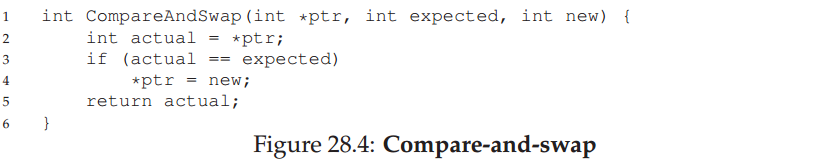
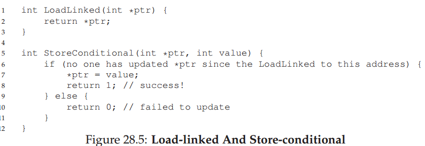

# 28 锁

## 28.1 锁：基本想法

下面例子，假设我们的临界区看起来像这样，更新一个共享变量的权威方法如下：

```
balance = balance + 1;
```

当然，其他的临界区也是可行的，比如向一个链表添加元素或者更多的复杂更新数据结构，但是我们仅仅现在保留这个简单的例子。如果要使用一个锁，我们添加一些代码在临界区周围，如下所示：

```
1 lock_t mutex;
2 ...
3 lock(&mutex);
4 balance = balance + 1;
5 unlock(&mutex);
```

一个锁仅仅就是一个变量，如果要使用当然要先定义某种类型的锁变量（比如上面提到的mutex）。这个锁变量在任何瞬间都维护着这个锁的状态。它要么是可用的（unlocked或者free），此时没有线程持有这个锁；要么是被持有着（locked或者hold），此时正好有一个线程持有着这个锁并且有可能正在临界区中内。我们也可以在这个数据类型上存储其他信息，比如哪个线程持有锁，或者一个维护者请求锁队列，但这样的信息是对用户是隐藏的。

lock()和unlock()的程序语义很简单。调用程序lock（）试图获取锁；如果没有其他线程持有lock（比如它处于free状态），该线程将获得锁定并进入临界区;这个线程也被称作是锁的拥有者。 如果另一个线程在同一个锁变量上调用lock()（mutex这个例子），只要该锁被另一个线程保持，它就不会返回;在这种方式之下，当一个线程持有时其他线程会被阻止进入临界区。

一旦锁的持有者调用unlock()，锁就变得可用了（free）。如果没有其他线程在等待锁（即没有其他线程调用了lock()后被卡阻塞在那里），锁的状态简简单单的被切换成free。如果有等待的线程（阻塞在lock()处），其中一个线程将（最终）观察到（或被告知的）锁状态的这种变化，获得锁并进入临界区。

锁向程序员提供一些最低限度的调度控制。在一般情况下，我们可以认为，不管操作系统如何选择，线程是由程序员创建，但由操作系统调度的实体。锁将一些控制权交还给程序员；通过将一段代码段上锁，程序员可以保证那段代码中不超过一个线程中是活跃的。因此帮助改变传统的操作系统调度的混乱状态到一个被更好的控制的状态。

## 28.2 Pthread Locks

## 28.3 Building A Lock

## 28.4 Evaluating Locks

## 28.5 Controlling Interupts

## 28.6 Test And Set (Atomic Exchange)

## 28.7 构建一个可以工作的自旋锁

## 28.8 评价自旋锁

## 28.9 Compare-And-Swap

一些系统提供了另一个硬件原语操作，即compare-and-swap指令（在SPARC上的叫法），或者是compare-and-exchange（在x86上的叫法）。这个单指令的C语言伪代码如图28.4所示。



compare-and-swap的基本想法是测试ptr指针指向内存位置上的值是否与expected相等，如果相等则更新这个内存位置上的值为新值new，否则则什么都不做。不论在哪种情况下，它都会返回这个内存位置上的值，它允许调用者通过返回值获知该操作是否成功。

通过compare-and-swap指令，我们可以构建一个与test-and-set非常类似的锁。比如，我们可以通过替换上文中的lock()如下：

```
1 void lock(lock_t *lock) {
2     while (CompareAndSwap(&lock->flag, 0, 1) == 1)
3         ; // spin
4 }
```

代码的剩余部分与上文中test-and-set的例子一致。两段代码工作基本一致，首先简单检查flag是否为0，如果为0则原子的交换为1也即获得了这个锁。其他试图获取这个已经被持有的锁的线程会陷入自旋等待直到这个锁被最终释放。

如果你想知道真实，x86版本下的C代码compare-and-swap，下面代码可能会有用（来自[S05]）：

```
1 char CompareAndSwap(int *ptr, int old, int new) {
2     unsigned char ret;
3 
4     // Note that sete sets a ’byte’ not the word
5     __asm__ __volatile__ (
6         " lock\n"
7                 " cmpxchgl %2,%1\n"
8         " sete %0\n"
9         : "=q" (ret), "=m" (*ptr)
10        : "r" (new), "m" (*ptr), "a" (old)
11        : "memory");
12     return ret;
13 }
```

最后，你可能察觉到，compare-and-swap是一个比test-and-set更有力的指令。我们将在之后使用一些这种能力的，当我们简要地深入到wait-free synchronization中[H91]。然而，如果只是需要使用它构建一个简单的自旋锁，它的行为与我们上面所分析的自旋锁一致。

## 28.10 Load-Linked and Store Conditional

## 28.11 Fetch-And-Add

## 28.12 太多自旋：What Now?

## 28.13 一个简单办法：Just Yield, Baby

## 28.14 使用队列：用睡眠取代自旋

与我们以前的办法相比，真正的问题是他们留下太多太多时间去尝试。调度确定哪个线程下一个运行; 如果调度作出了一个不好的选择，一个线程运行必须要么自旋等待锁（我们的第一种方法），或立即放弃CPU（我们的第二个方法）。无论使用哪种方式，都有潜在的资源浪费并且无法预防饥饿。

因此，我们必须明确地施加一些控制谁可以获取到锁，当目前持有者释放后。要做到这一点，我们需要多一点操作系统的支持，以及一个队列来跟踪哪些线程正在等待进入锁。

为简单起见，我们将使用的Solaris提供的两个调用：park()将调用线程睡眠，unpark(threadID)唤醒通过threadID所指定的特定线程。这两个调用可串联用于构建一个锁，这个锁可以保证，如果线程试图获得一个被其他线程持久的锁并唤醒它，它将会进入睡眠状态，当锁是free时将会被线程。让我们看28.9来理解这些原语的可能使用。

这个例子中我们做了一些有趣的事情在。首先，我们结合之前的test-and-set的想法与一个明确的锁定等待者的队列中来提供一个更有效率的锁。其次，我们用一个队列，以帮助控制谁将得到接下来的锁，从而避免饥饿。

您可能会注意到guard是如何使用（图28.9，第16页），基本上就是一个围绕着flag的自旋锁。这种做法，这并不完全避免自旋等待;一个线程在获取锁或者释放锁中可能会被中断，因此导致了其他线程字段等待这个指令再次执行。然而消耗在资源等待上的时间非常有限（在lock与unlock代码中仅仅只有几条指令，而不是用于定义的临界区），因此这个方法可能是合理的。

第二，你可能会在lock()中注意到，当一个线程不能获得时锁（它已经被持有），我们会小心的把该线程自身添加到队列中（通过调用gettid（）调用来获得当前的线程ID），设置guard为0，并放弃CPU。读者可能会问：如果释放guard锁在park()之后而不是之前，会发生什么？提示：一些不好的事情。

您可能还注意到一个有趣的事实是，当一个线程从队列中被唤醒时，flag不会被设置回0。 为什么是这样？嗯，它是不是一个错误，而是一种必然！当一个线程被唤醒时，它刚从park()返回；然而，它在代码点时不持有guard，因此不能将该标志设置为1，连尝试的机会没有。因此，我们只是直接从线程释放锁到下一个请求它的线程；标志在中间时未设置为0。

最后，你可能会在解决方案中发现的被感知竞争条件，就在调用park()之前。在一个错的时间点时，一个线程将即将park，假定它应该睡眠直到锁不再被持有。在这个时候切换到另一个线程（比如一个线程持有着锁）可能导致麻烦，例如，如果该线程之后就释放锁，被第一个线程park的线程将永远睡眠（可能）。这个问题有时也被称为唤醒/等待竞争；为了避免它，我们需要做一些额外的工作。

为了避免它，Solaris通过增加第三个系统调用setpark()来解决这个问题。通过调用它，一个线程可以提示它*即将*park。如果它正好被中断，而另一个线程中调用在真正调用park前调用unpark，随后的park马上返回而不是睡眠。修改的代码量很小（在lock()内）：

```
1 queue_add(m->q, getid());
2 setpark(); // new code
3 m->guard = 0;
```

## 28.15 不同的操作系统，不同的支持

## 28.16 两阶段锁

## 28.17 总结
